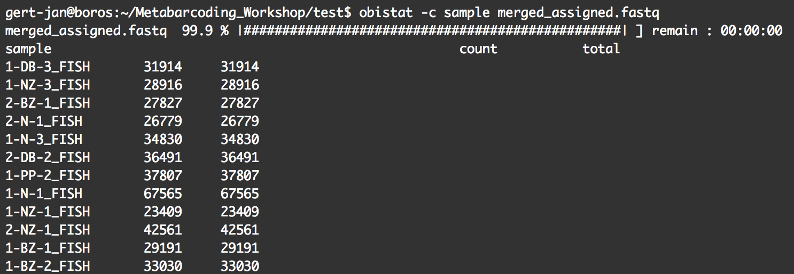
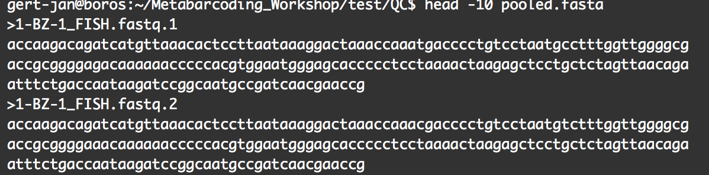
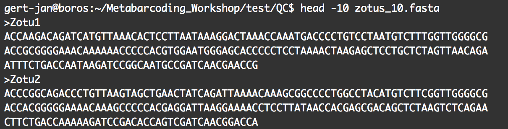
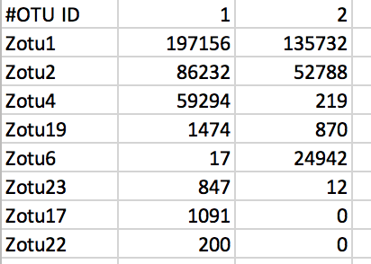

***
## Chapter 1: Introduction
***
### _About this workshop_

Welcome to the workshop _Bioinformatics for eDNA metabarcoding_!

The purpose of the workshop is to give an introduction on the bioinformatics of eDNA metabarcoding and make you comfortable to explore your next-generation sequencing data. During this workshop, we'll go through the different steps of a bioinformatic pipeline to analyse eDNA metabarcoding NGS data, taking you from raw sequencing data all the way to an OTU table with taxonomic assignments ready for statistical analysis. You will learn how to assemble paired-end sequences, demultiplex the data, filter sequences based on quality, cluster and denoise the data, and assign taxonomy to OTUs. This accompanying document gives additional information about each step of the bioinformatic pipeline, plus sample code and output.

Please do not distribute this document without written consent from the author.

### _Introduction to eDNA metabarcoding library prep_

I thought it would be a good idea to start with a brief introduction into how eDNA libraries are prepared in the lab and what sequencing strategies are typically chosen. This will give insight into how the sequences in an eDNA library are structured, which can be helpful to understand some of the choices made during the bioinformatic's part of your experiment.

Currently, there are three main methods used to prepare eDNA metabarcoding libraries, each with their downsides and advantages, i.e., ligation, 2-step PCR, and 1-step PCR with fusion primers.

### _Software used during the workshop_

Since the start of eDNA metabarcoding research, lab groups have been using several pre-existing software packages and even developed a few new ones to analyse the sequencing data. Furthermore, frequent updates are made to each software and newly developed programs are made available on a regular basis. This means that there are multiple ways to analyse your data, without there being a clear optimal one.

Althoug software options are numerous, each pipeline follows the same basic steps, i.e., assembling paired reads, demultiplex the data, quality filtering, denoising or clustering, and taxonomic assignment. More information on each of these steps can be found in the corresponding chapters in this document. 

Modifications to these steps can be made to optimise the pipeline for your specific data. Some software packages are equipped to handle all of these steps, such as QIIME (website: https://qiime2.org) or ObiTools (website: https://git.metabarcoding.org/obitools/obitools/wikis/home), while other software can only be used for a single step, such as cutadapt (website: https://cutadapt.readthedocs.io/en/stable/) and PEAR (website: https://cme.h-its.org/exelixis/web/software/pear/doc.html). It is easiest to use a single software package to run through the whole pipeline, since each program will make unique modifications to sequencing files that make it unable to be used by other software. However, being able to use different programs will allow for more freedom in your bioinformatic's pipeline, as the options available to you will increase. To be able to use multiple software packages in your pipeline, it is important to understand how a specific program changed the structure of the sequencing file and learn how these modifications can be reverted back. More information on the structure of sequencing files (Fastq and Fasta) and how specific software will change this structure can be found back under the header _Checking files with text editors_, in __Chapter 2: Assembling paired reads__.

Today, we will be using multiple programs in our bioinformatic's pipeline, plus learn how to change the structure of sequencing files so they can be used by these programs:  

  + *Quality control*: FastQC - https://www.bioinformatics.babraham.ac.uk/projects/fastqc/  
  + *Assembling paired reads*: PEAR - Paired-End Read Merger -  https://cme.h-its.org/exelixis/web/software/pear/doc.html  
  + *Demultiplexing*: ObiTools - https://git.metabarcoding.org/obitools/obitools/wikis/home  
  + *Quality filtering*: USEARCH - https://www.drive5.com/usearch/  
  + *Denoising*: USEARCH - https://www.drive5.com/usearch/  
  + *Taxonomic assignment*: BLAST - https://blast.ncbi.nlm.nih.gov/ 

### _How to use this document_

This document was made to complement the eDNA metabarcoding workshop. It provides additional information about all the steps in the bioinformatic's pipeline, provides sample code, information about what the code does, and sample output. It would be a good idea to use this document as a guideline in future experiments. Better even would be to deviate from it, explore other options and optimise the analysis for your data when you feel comfortable with analysing eDNA metabarcoding data.

Each chapter in this document is dedicated to a specific step in the pipeline we will follow during the workshop. The chapter will start by introducing the concept of what we want to achieve. Afterwards, sample code is given and will look like this:

> example code

This sample code will use generic file names and sometimes information on how to access the software specifically on BOROS. If you are using your own laptop, these steps will not be applicable to you. Sample code is followed by an explanation of every option of the code and a figure of the output file whenever possible.

During the workshop and in the future it might be a good idea to copy-paste the code into your terminal and change the filenames accordingly to reduce the risk of typo's. Typo's are, unfortunately, the __number 1__ reason you will see error messages!

#### __Let's get started!__

***
## Chapter 2: Assembling paired reads
***

### _Introduction_

Once the sequencing run is completed on the Illumina MiSeq, you will be given one or two files depending on the sequencing kit and sequencing options that were used. The file names appear to be random, but will always end in __R1_001.fastq.gz__ and __R2_001.fastq.gz__, for the forward and reverse sequencing file, respectively. If single-end sequencing was performed on your library, only the __R1_001.fastq.gz__ file will be provided. As you can see, these files are zipped ( __.gz__ ). However, there is no need to unzip them before analysis, since most software will be able to read and use zipped files.

### _Quality control_

One of the first things we want to do, is look at the quality of the raw sequencing file and make sure everything is fine. The program we will be using is __FastQC__ (website: https://www.bioinformatics.babraham.ac.uk/projects/fastqc/). This software has a graphical user interface (GUI) and will report on basic statistics, sequence quality, sequence length, ... It is also possible to use the command line, which will output a .html report with the same statistics. If your library was sequenced at Otago Genomics, a .html report will have been provided along with the sequencing files. An example figure of the report can be found below.

From this report, you want to make sure that:  

  1. The _per base sequence quality_ stays within the green area (especially for Illumina MiSeq data).  
  2. The data does not contain _N_ bases.  
  3. All sequences have _the same length_, equal to the cycle number of your kit.

### _Merging paired-end sequences_

This step is only needed if you have paired-end sequencing data!

Once we made sure that the data we received from the sequencing service looks okay, we can start with merging the forward ( __R1_001.fastq.gz__ ) and reverse ( __R2_001.fastq.gz__ ) sequencing files. During this process, we will stitch together every forward and reverse sequence to obtain a sequence of similar length to the amplicon insert size. There are a myriad of software out that are able to merge paired-end sequences, e.g. COPE, FLASH, PANDAseq, QIIME, ... 

Today, we will be using __PEAR__ (Paired-End Read Merger: https://cme.h-its.org/exelixis/web/software/pear/doc.html), which is an ultrafast and highly accurate pair-end read merger. When the amplicon size of your library is smaller than the cycle number of your sequencing kit, the forward and reverse sequences will partially overlap. This is highly recommended for eDNA metabarcoding and will allow you to only use the basic arguments within the PEAR software. First we want to make sure that we are in the correct folder.

> cd path/to/folder/  

If on BOROS, we will need to load the software into the system.

> screen  
> module load pear/0.9.11  

And merge the forward and reverse sequencing files with the following command.

> pear -f forward_R1_001.fastq.gz -r reverse_R2_001.fastq.gz -o merged.fastq  

  + *-f*: forward sequencing file
  + *-r*: reverse sequencing file
  + *-o*: output file

An example of the output from the PEAR analysis can be found below.

Another option to merge paired-end sequences is __ObiTools__ (website: https://git.metabarcoding.org/obitools/obitools/wikis/home). This software takes much longer to run, but successfully merges a larger proportion of reads. I have never looked into the downstream consequences (i.e., species detection) of the two different programs. For people working on BOROS, ObiTools is installed systemwide and does not need to be loaded in.

> illuminapairedend --score-min = 40 -r reverse_R2_001.fastq.gz forward_R1_001.fastq.gz > merged.fastq
> obigrep -p 'mode!="joined"' merged.fastq > merged_joined.fastq

  + *illuminapairedend*: utility that aligns the two reads and returns the reconstructed sequence
  + *--score-min*: allows discarding sequences with low alignment quality
  + *-r*: filename of the reverse reads (-f is not needed for the forward sequencing file)
  + *obigrep*: removal of sequences that cannot be merged by illuminapairedend 
  + *-p*: python expression that allows all sequences that do not have "mode=joined" as attribute to be kept

### _Checking files with text editors_

It is a good habit to occasionally check your sequencing files after you perform some commands to see how the software changed the structure of the file and if the code did what it was supposed to do. Both sequencing files (Fastq and Fasta) are text files structured in a specific way. Your sequencing files can be read by any text editor, such as TextWrangler. Vim or Nano are text editors that are available via the command line on BOROS. Another option would be to use the command _head_.

> head -10 merged.fastq

  + *head*: command to look at the top lines of a file
  + *-10*: number of lines to be displayed on the screen

The reason I bring this up at this particular point is that the structure of the file has been modified drastically if you used ObiTools to merge the paired-end sequences. An example of the normal structure of Fastq and Fasta files can be found below. Underneath you can find an example of how ObiTools changed the structure of the Fastq file.

 

Looking at the Fastq file from Obitools shows 2 very important modifications:

  + metadata is added to the sequence name (1st line) 
  + the sequence itself is transformed to lower case
  
When we change to another software package in the downstream analysis, we need to keep in mind the modifications made by ObiTools and revert the sequence files back to the original structure of Fastq or Fasta files. Otherwise the data cannot be read properly and you will receive errors!

***
## Chapter 3: Demultiplexing
***

### _Introduction_

Now that the paired-end sequences are stitched together, we will assign each sequence to the corresponding sample, a process referred to as demultiplexing. 

During library preparation, each sample was assigned a specific barcode combination, with at least 3 basepair differences between each barcode used in the library. By searching for these specific sequences, which are situated at the very beginning and very end of each sequence, we can assign each sequence to its sample. We will be using __ObiTools__ for demultiplexing our dataset today. ObiTools requires an additional text file with information about the barcode sequences and primer sequences in a single line per sample separated by tabs. The forward and reverse barcode (indicated in the text file by "tags") are separated by ":". All forward and all reverse barcodes need to be of the same length. So, if different length barcodes were used to increase complexity in the library, you will need to use multiple files per experiment __OR__ add the remaining basepairs of the barcodes with longer lengths to the beginning of the forward or reverse primer. An example file can be found below.

 

After preparing the barcode information text files, make sure you place them in the same folder as the sequence file. 

> cd path/to/text_file  
> scp -r file name@boros:~/path/to/folder

### _Assigning sequences to corresponding samples_

We are now ready to call the command that will assign each sequence to its corresponding sample. 

> ngsfilter -t Barcode_file.txt -u Unidentified_sequences.fasta -e 1 merged.fastq > merged_assigned.fastq

  + *ngsfilter*: allows to demultiplex sequence data by identifying barcodes and primer sequences
  + *-t*: used to specify the file containing the sample description
  + *-u*: filename used to store the sequences unassigned to any sample
  + *-e*: used to specify the number of errors allowed for matching primers
  
If differing length barcodes, and therefore multiple barcode files, were used, we can now combine these sequencing files back together.

> cat sequence_file_1.fastq sequence_file_2.fastq > merged_assigned.fastq

  + *cat*: concatenates or combines multiple files into one

Before proceeding to the next step, it would be good to have a look at the sequence file. This command can be used any time you process the sequencing file downstream.

> obihead --without-progress-bar -n 1 merged_assigned.fastq

  + *obihead*: similar function to the _head_ command used earlier
  + *--without-progress-bar*: used to not display a progress bar when command is running
  + *-n*: used to specify the number of sequences you want to look at

Now that we have each sequence assigned to a sample, it is possible to count the number of sequences per sample. This command can be used any time you process the sequencing file downstream when the sequences have the attribute "sample".

> obistat -c sample merged_assigned.fastq

  + *obistat*: computes basic statistics for attribute values (e.g. sample) of sequences
  + *-c*: attribute used to categorize the sequences

Since the software we will be using to filter our dataset based on quality and other parameters (i.e., USEARCH) is not able to discard sequences longer than a specified length, we will do that at this stage with ObiTools.

> obigrep -L 100 merged_assigned.fastq > merged_assigned_L100.fastq

  + *obigrep*: command similar to the Unix _grep_ command. It selects a subset of sequences from a file
  + *-L*: keeps sequences whose length is equal or shorter than the specified number

Since we are ready now to filter our data based on quality and other parameters, we need to revert some changes made to the sequencing file by ObiTools. As mentioned before, ObiTools adds a lot of metadata to the sequence name. This metadata is necessary when going through the pipeline in ObiTools, but will need to be removed before we continue. Luckily ObiTools has put in a command to get rid of the metadata we do not need. We only need to keep one part of the metadata, namely the information of which sample each sequence belongs to.

> obiannotate -k sample merged_assigned_L100.fastq

  + *obiannotate*: allows adding/modifying/removing annotation attributes attached to sequence records (i.e., metadata)
  + *-k*: keeps only the specified attributes 

The free version of USEARCH, the software used for filtering our dataset, only allows for small files to be entered in the software. If your file sizes are too big, you will receive an error message that tells you to upgrade the software. While our files are generally much too big at this stage to be entered in USEARCH, there is a handy work-around by splitting the files per sample.

> obisplit -t sample merged_assigned_L100.fastq

  + *obisplit*: splits the input sequence file in a set of subfiles according to the values of a given attribute
  + *-t*: attribute key used to split the sequence file

At this stage, it would be good to make a new folder where we will put all the new sequence files in (i.e., the files split per sample) and move to that folder in the command line for the next step in our bioinformatic's pipeline.

> mkdir QC  
> scp -r sequence_file.fastq QC/  
> cd QC/

***
## Chapter 4: Quality filtering
***

### _Introduction_

During the quality filtering step, we will discard all sequences that do not adhere to a specific set of rules. We will be using the program USEARCH (website: ) for this step. During this step, we will filter out all sequences that have one or multiple "N" as basepairs. Sequences that are shorter than our amplicon length will be discarded as well. Lastly, we will filter out all sequences that have a low quality.

Since we have multiple sequencing files that we need to process (the number of files will depend on your sample number), it will be much easier to run the command once and loop it through all the files, rather than type in the command once for each sequencing file. For more information on loops, follow the information and excercises on the Software Carpentry website (http://swcarpentry.github.io/shell-novice/) if needed.

### _filtering data based on quality and other parameters_

For people on BOROS, we will first need to load the software into the system.

> module avail  
> module load usearch/11.0.667

We are now ready to call the command that will filter our sequences based on a set of parameters.

> for fq in *.fastq; do usearch -fastq_filter $fq -fastq_maxee 1 -fastq_minlen 80 -fastq_maxns 0 -relabel $fq. -fastaout $fq.fasta -fastqout $fq.fastq; done

  + *for fq in*: starting loop and perform following command to all files ending in .fastq
  + *do*: perform the following command
  + *usearch*: use the USEARCH software
  + *-fastq_filter*: performs quality filtering and/or conversion of a Fastq to Fasta file
  + *-fastq_maxee*: discard reads with > 1 total expected errors for all bases in the read
  + *-fastq_minlen*: discard sequences with < 80 basepairs
  + *-fastq_maxns*: discard sequence if there are more than 1 Ns in the read
  + *-relabel*: generates new names (same as file name) for each sequence followed by a number
  + *-fastaout*: returns a Fasta output file
  + *-fastqout*: returns a Fastq output file
  + *done*: ends the loop

We will now combine all Fastq files together. This will allow us to have a look in FastQC and check the quality of the sequence file after filtering.

> cat *.fastq.fastq > pooled.fastq

  + *cat*: concatenates or combines multiple files into one

We will also combine all Fasta files together, which will be used in the downstream analysis.

> cat *.fasta > pooled.fasta

  + *cat*: concatenates or combines multiple files into one

Before we can move on to the next chapter to generate an OTU table, there are two steps we need to perform first. As mentioned earlier, ObiTools changed our sequence data from upper case to lower case. Up until now, there was no need to change the sequences back to upper case. However, the next command in our pipeline will report an error for lower case sequences. We, therefore, have to transform our sequences back to upper case with the following command.

> tr '[:lower:]' '[:upper:]' < pooled.fasta > pooled_upper.fasta

  + *tr '[:lower:]' '[:upper:]'*: convert all incoming text from lower to upper case

Lastly, we need to dereplicate our sequences into unique sequences. Since metabarcoding data is based on an amplification method, the same DNA molecule can be sequenced several times. In order to reduce both file size and computational time, and to get easier interpretable results, it is convenient to work with unique sequences instead of the sequences itself. 

During this step, we will also delete any unique sequences that are not prevalent in our dataset. There is still a huge discussion going on about what the best cutoff is. Some people argue to only delete singleton sequences (i.e., sequences that are present only once in your dataset), others argue for deleting sequences that only appear less than 10 times in your dataset. There is also a case to be made for a proportional cutoff at 0.1% or 1% of the data. Since this cutoff is still not decided upon now, we will make it easy for ourselves at the moment and choose to delete sequences that appear less than 10 times in our dataset for now.

> usearch -fastx_uniques pooled_upper.fasta -fastaout uniques_10.fasta -relabel Uniq -sizeout -minuniquesize 10

  + *-fastx_uniques*: find the set of unique sequences in an input file
  + *-fastaout*: specifies a Fasta output file
  + *-relabel*: specifies a string that is used to re-label the dereplicated sequences
  + *-sizeout*: specifies that size annotations should be added to the output sequence labels
  + *-minuniquesize*: sets a minimum abundance

***
## Chapter 5: Denoising or clustering
***

### _Introduction_

Now that our dataset is filtered and each sequence is assigned to their corresponding samples, we are ready for the next step in our bioinformatic's pipeline, i.e., looking for __biologically meaningful__ OR __biologically correct__ sequences. This is done through _denoising_ or _clustering_ the dataset, while at the same time removing any chimeras and left-over PCR and/or sequencing errors.

Scientists are currently debating on what the best approach is the obtain "biologically meaningful" or "biologically correct" sequences. There are numerous papers published on this topic. Unfortunately, this is something that is outside the scope of this workshop to go into at depth. But here is the gist of it...

There are basically two trains of thought, clustering the dataset or denoising the dataset. With clustering the dataset, an OTU (Operational Taxonomic Unit) sequence should be at least a given percentage different from all other OTUs, and should be the most abundant sequences in its neighborhood. People traditionally choose to cluster at 97%, which means that the variation between sequences should be at least 3%. The concept of OTU clustering was introduced in the 1960s and has been debated since. With denoising the dataset, on the other hand, the algorithm attempts to identify all correct biological sequences in the reads, which is visualised in the figure below. This schematic shows a clustering threshold at 100% and trying to identify errors based on abundance differences. The retained sequences are called ZOTU or Zero-radius Operational Taxonomic Unit. Some software, such as QIIME, are calling these ASV for "amplicon sequence variance" or "actual sequence variance". However, it seems that ZOTU was used first, so we should stick to this name.

This difference in approach may seem small, but has a very big impact on your final dataset! When you denoise the dataset, it is expected that one species may have more that one ZOTU, while if you cluster the dataset, it is expected that an OTU may have more than one species assigned to it. This means that you may loose some correct biological sequences that are present in your data when you cluster the dataset, because they will be clustered together. In other words, you will miss out on differentiating closely related species and intraspecific variation. For denoising, on the other hand, it means that when your reference database is incomplete, or you plan to work with ZOTUs instead of taxonomic assignments, your diversity estimate will be highly inflated.

So, it is up to you what you think is best! For this workshop, we will follow the denoising pathway, since most people are working on vertebrate datasets with good reference databases and are interested in taxonomic assignments. The codes for clustering can be found at the end of this chapter (without additional information).

### _Denoising the dataset_

Before we can denoise our dataset, we should sort our unique sequences by abundance.

> usearch -sortbysize uniques_10.fasta -fastaout uniques_10_sorted.fasta

  + *-sortbysize*: sort sequences by decreasing size annotation
  + *-fastaout*: specifies a Fasta output file

Now we are finally ready to denoise our dataset.

> usearch -unoise3 uniques_10_sorted.fasta -zotus zotus_10.fasta -tabbedout unoise3_10.txt

  + *-unoise3*: uses the UNOISE algorithm to perform denoising (error correction) of amplicon reads
  + *-zotus*: Fasta file format where the predicted correct biological sequences are written to
  + *-tabbedout*: a tabbed text file which reports the processing done for each sequence

The output Fasta file from this command will be used as the input file for the taxonomic assignment in the next chapter. For the last step in this chapter, we will make a table that shows the number of reads per sample and per ZOTU, which will be used for downstream statistical analyses.

> usearch -otutab pooled_upper.fasta -zotus zotus_10.fasta -otutabout zotutab_10.txt

  + *-otutab*: generates an OTU or ZOTU table by mapping filtered reads to OTUs or ZOTUs
  + *-zotus*: provides the file for the search database 
  + *-tabbedout*: filename for the OTU or ZOTU table

Code for clustering the dataset:

> usearch -cluster_otus uniques_sorted.fasta -otus otus.fasta -uparseout uparse.txt -relabel Otu  
> usearch -otutab pooled_upper.fasta -otus otus.fasta -otutabout otutab.txt

***
## Chapter 6: Taxonomic assignment
***

### _Introduction_

Once denoising has been done, the next step in our bioinformatic's pipeline is to assign the barcodes (or ZOTUs) to the corresponding species in order to get the complete list of species associated to each sample. Taxonomic assignment of sequences requires a reference database compiling all possible species to be identified in the sample. Assignment is then done based on sequence comparison between sample sequences and reference sequences, i.e., BLAST.

For this workshop, we will be using the complete NCBI (website: https://www.ncbi.nlm.nih.gov) database. However, for your personal work, you might want to build a custom reference database containing only the taxonomic groups able to be amplified with your qPCR assay or only the genetic region targeted by your assay. One way to build the reference database is to use the _ecoPCR_ program from __ObiTools__. More information about this can be found here: https://pythonhosted.org/OBITools/scripts/ecoPCR.html.

### _Taxonomic assignment of sequences_

There are two possible ways to perform BLAST on the sequence file, through the website (https://blast.ncbi.nlm.nih.gov/Blast.cgi?PROGRAM=blastn&PAGE_TYPE=BlastSearch&LINK_LOC=blasthome) and via the command line. While it might seem easier to perfrom BLAST through the website, I recommend using the command line, since it gives you additional options and settings. During the workshop, I will quickly show how the website works and how to download your data, but we will mainly focus on BLAST via the command line.

For people on BOROS, we will first need to load the software into the system.

> module load BLAST+/2.7.1

Now we are finally ready to assign taxonomy to our sequences.

> blastn -query zotus_10.fasta -task megablast -db nt -out blast_zotus_10_perc_99.txt -max_target_seqs 100 -perc_identity 99 -negative_gilist sequence.gi -qcov_hsp_perc 95 -num_threads 10 -outfmt "6 qaccver saccver ssciname staxid length pident mismatch qcovs evalue bitscore qstart qend sstart send gapopen"

  + *blastn*: searches a nucleotide query against nucleotide subject sequences or a nucleotide database
  + *-query*: query file name
  + *-task*: "megablast" --> for very similar sequences
  + *-db*: BLAST database name
  + *-out*: output file name
  + *-max_target_seqs*: number of aligned sequences to keep
  + *-perc_identity*: percent identity cutoff
  + *-negative_gilist*: restrict search of database to everything except the GI's listed in this file
  + *-qcov_hsp_perc*: percentage of query sequence needed to be covered
  + *-num_threads*: number of threads to use in blast search
  + *-outfmt*: alignment view options - 6 = tabular
  
Both the results downloaded from the website as the text file received from the command line can be viewed in MEGAN (website: http://ab.inf.uni-tuebingen.de/software/megan6/) to get a visual representation of the BLAST results. MEGAN should only be used as an initial glance at the data, since there are multiple bugs and errors in the software.

This will be all for this workshop. If there is a need to cover how to analyse BLAST data in detail and how to perform statistical analyses on these datasets in R, please let us know.

#### __Thank you all for your attention!__

